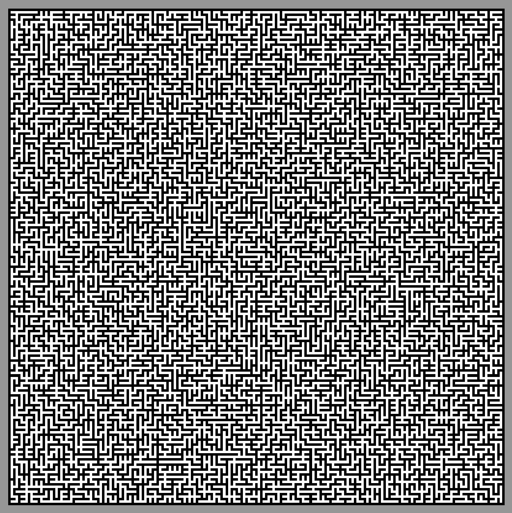

# Maze-Generator
Maze generator using the Prim algorithm.

# Overview
Starting from initial txt data that contains the size of the graph and the weights linking the nodes, we use the [Prim algorithm](https://en.wikipedia.org/wiki/Prim%27s_algorithm) that finds a minimum spanning tree. Using this construction we then create pbm images that represent maze of differents sizes. 
Two different structures are used to store the nodes to explore first a set and secondly a binary heap (file with suffix -bh).
Computation times also have been measured and show how faster the binary heap is.

*Example - map_2_3_42.txt*
```
2 3      # size of the graph: 2x3 nodes
0 -14    # each node weights : bottom / right
-19 -19  # meaning cost of the edge starting from the node and going to the node below it / cost of the edge starting from the node and going to the node at its right
18 -8
0 1
3 -5
3 14
```

# How to compile and execute the code
Use the makefile and especially the *make compile-all* command. You can then use the *app-generation-maze* or *app-generation-maze-bh* exectuables, by giving in the command line the path to a txt input file (stored in the data folder).

# Example of results

